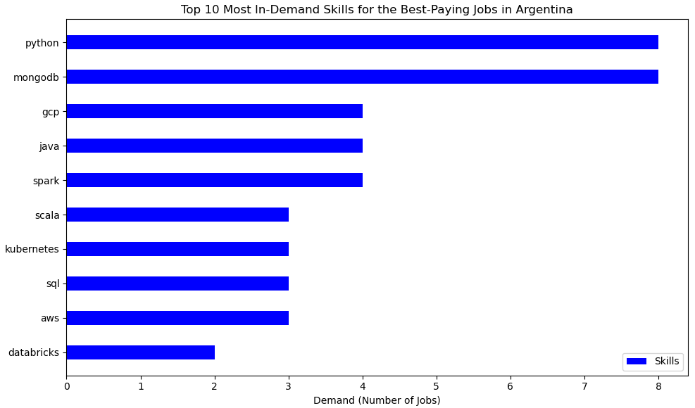
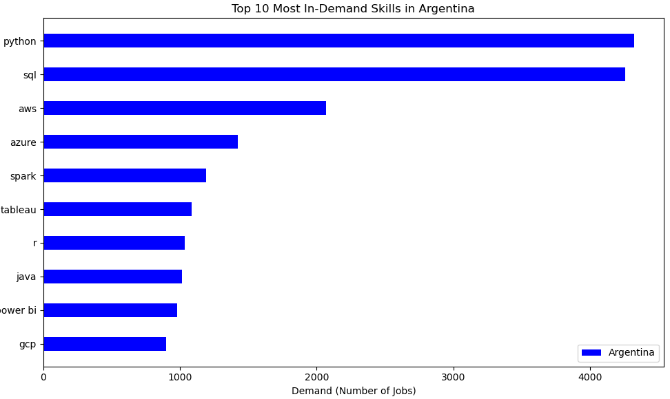
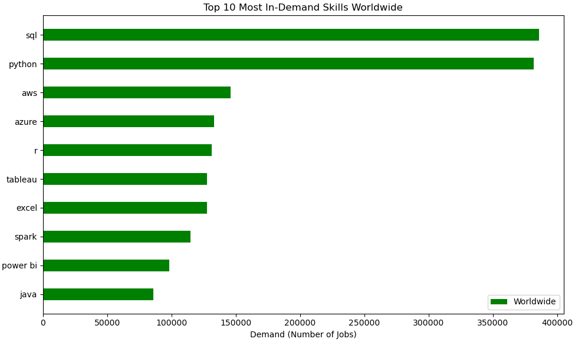

# Introduction
Using a dataset with job market data focused on the IT sector, this project explores the highest-paying jobs, the most in-demand skills available in the Argentine market, and compares them with global trends to assess whether the local market is up to date. Additionally, It analyzes the highest-paying skills in Argentina and which companies offer the most job opportunities in Argentina.

You can check the SQL queries right here: [project_SQL folder](/project_SQL/)

# Background  
The idea for this project comes from the need to understand the most in-demand skills and technologies in the Argentine job market. The goal is to identify key areas to learn in order to improve job opportunities. As a future engineer, it is important to stay up to date with the latest technologies to remain competitive and decide which area to specialize in.  

## To make an informed decision on which technologies and areas to study, I aim to answer the following questions:  
1. What are the top-paying jobs in Argentina?  
2. What skills are required for those top-paying jobs?  
3. What skills are most in demand in Argentina, and how do they compare globally?  
4. Which skills are associated with higher salaries?  
5. Which companies have the highest number of job openings in Argentina? 

# Tools Used in This Project  

For the analysis of this data, I used several tools:  
- **SQL**: The most important tool, allowing me to query databases and answer key questions.  
- **Python**: Used to create visualizations and better understand the data.  
- **Visual Studio Code**: Used for database management and executing SQL queries and Python code.  
- **Git & GitHub**: Essential for version control and sharing the project.

# Analysis

Each query of this project answer a question to make my decision, there is how I approched each quest

### 1. What are the top-paying jobs in Argentina?
This query retrieves the top 10 highest-paying job postings in Argentina. It selects key job details such as title, company name, location and average annual salary. The data is sourced from the `job_postings_fact` table, with company names retrieved via a **LEFT JOIN** with the `company_dim` table. The results are filtered to include only jobs with a non-null salary and are sorted in descending order based on salary.

```sql
SELECT 
  job_postings_fact.job_title,
  company_dim.name AS company,
  job_postings_fact.job_location,
  job_postings_fact.salary_year_avg
FROM job_postings_fact
LEFT JOIN company_dim ON job_postings_fact.company_id = company_dim.company_id
WHERE
    salary_year_avg IS NOT NULL
    AND job_country = 'Argentina'
ORDER BY
    salary_year_avg DESC
LIMIT 10

```
| Job Title                                    | Company         | Job Location                                     | Salary (Yearly) |
|----------------------------------------------|----------------|-------------------------------------------------|----------------|
| Director of Engineering, ML Platform        | MongoDB        | Anywhere                                       | 222000.0       |
| Staff Data Scientist                        | MongoDB        | Anywhere                                       | 207500.0       |
| Staff Engineer, Service Architecture        | MongoDB        | Anywhere                                       | 197500.0       |
| Cloud Operations Engineer (3rd Shift, FedRamp) | MongoDB     | Anywhere                                       | 182500.0       |
| Data Scientist, Growth                      | Near           | Anywhere                                       | 157000.0       |
| Senior Data Engineer                        | MediaLab       | Argentina                                      | 147500.0       |
| Data Engineer                               | Dialpad        | Buenos Aires, Argentina                        | 147500.0       |
| [VMB] Senior Data Engineer                  | Software Mind  | Buenos Aires, Argentina                        | 147500.0       |
| LAS Seeds Data Engineer                     | Syngenta Group | Vicente López, Buenos Aires Province, Argentina | 134241.0       |
| Data Scientist Manager                      | Visa           | Buenos Aires, Argentina                        | 132500.0       |

The conclusions we can draw from this query are:
- **Wide Salary Range**: The highest paying jobs range from $222,000 to $132500 per year.
- **Diverse Employers**: The results show 7 different companies offering high-paying jobs, indicating strong competition.
- **Job Title Dominance**: The majority of these high-paying roles are in data-related positions (Data Scientist, Data Engineer, etc.), highlighting the strong demand for data professionals over other IT fields.

### 2. What skills are required for those top-paying jobs?

The CTE (Common Table Expression) `top_jobs` retrieves the top 10 highest paying jobs in Argentina. The main query then retrieves the skills associated with those 10 jobs. Using an **INNER JOIN** between the tables `skills_job_dim`, `top_jobs`, and `skills_dim`, I obtained the skills associated with each job, and then I filtered the results to only include those in Argentina.
The second query is an auxiliary query used to generate a CSV file for creating a bar chart of the most in-demand skills.

```sql
WITH top_jobs AS(
    SELECT 
    job_postings_fact.job_id,
    job_postings_fact.job_title,
    company_dim.name AS company,
    job_postings_fact.job_location,
    job_postings_fact.salary_year_avg
    FROM job_postings_fact
    LEFT JOIN company_dim ON job_postings_fact.company_id = company_dim.company_id
    WHERE
        salary_year_avg IS NOT NULL
        AND job_country = 'Argentina'
    ORDER BY
        salary_year_avg DESC
    LIMIT 10
)
SELECT
    top_jobs.*,
    skills_dim.skills
FROM top_jobs
INNER JOIN skills_job_dim ON top_jobs.job_id = skills_job_dim.job_id 
INNER JOIN skills_dim ON skills_job_dim.skill_id = skills_dim.skill_id
ORDER BY
    top_jobs.salary_year_avg DESC
--Auxiliary query
SELECT
    COUNT(skills_dim.skill_id) as skills_demand_count,
    skills_dim.skills
FROM top_jobs
INNER JOIN skills_job_dim ON top_jobs.job_id = skills_job_dim.job_id 
INNER JOIN skills_dim ON skills_job_dim.skill_id = skills_dim.skill_id
GROUP BY
    skills_dim.skills
ORDER BY
    skills_demand_count DESC
LIMIT 10

```


*Bar Graph Visualizing the Top 10 Most In-Demand Skills for the Best-Payings Jobs In Argentina*

The conclusions we can draw from this query are:
- **Python and MongoDB** are the most in-demand skills, required in 8 out of the 10 top-paying jobs.
- **GCP, Java, and Spark** follow closely, each appearing in 4 job postings.
- **Scala, Kubernetes, SQL, and AWS** are required in 3 jobs each.
- **Databricks** is the least common among the top 10, appearing in only 2 job postings.

### 3. What skills are most in demand in Argentina, and how do they compare globally?

With this query, we will obtain the top 10 most in-demand skills for jobs in Argentina. Using an **INNER JOIN** between the tables `skills_job_dim`, `skills_job_dim`, and `skills_dim`, we retrieve the skills associated with each job, then sort them by demand.

```sql
SELECT 
    skills_dim.skills,
    COUNT(job_postings_fact.job_id) as demand
FROM job_postings_fact
INNER JOIN skills_job_dim ON skills_job_dim.job_id = job_postings_fact.job_id
INNER JOIN skills_dim ON skills_job_dim.skill_id = skills_dim.skill_id
WHERE
    job_country ='Argentina'
GROUP BY
    skills
ORDER BY
    demand DESC
LIMIT 10
```
This query does the same as the one above but without the Argentina condition because I want to know if the most in-demand skills in the Argentine market are the same as those in the rest of the world.
```sql
SELECT 
    skills_dim.skills,
    COUNT(job_postings_fact.job_id) as demand
FROM job_postings_fact
INNER JOIN skills_job_dim ON skills_job_dim.job_id = job_postings_fact.job_id
INNER JOIN skills_dim ON skills_job_dim.skill_id = skills_dim.skill_id
GROUP BY
    skills
ORDER BY
    demand DESC
LIMIT 10
```
After analising both list we can come to the conclusion that

- **Market Updates**: The most in-demand skills in Argentina are the same as those in the global market except for GCP which is in Argentina's top 10, while Excel holds that spot worldwide. This is a positive sign that the Argentine job market is aligning with top global technologies.
- **Tools for Analysis and Visualization**: The most in-demand tools include Excel, Power BI, and Tableau.
- **Data Analyst Languages**: The top two most in-demand skills are SQL and Python, both essential for data-related tasks. R is also commonly used.
- **Big Data and Cloud**: Tools like Apache Spark, Azure and GCP are in high demand.
- **Development**: We can conclude that most in-demand tools are focused on data analysis, except for Java.


*Bar Graph Visualizing the 10 most in-demand skills in Argentina*


*Bar Graph Visualizing the 10 most in-demand skills Worldwide*

### 4. Which skills are associated with higher salaries?

This query identifies the skills associated with the highest salaries. Using an **INNER JOIN** between the tables `job_postings_fact`, `skills_job_dim`, and `skills_dim`, it retrieves the skills linked to each job, then groups them by skill and sorts them by average salary.

```sql
SELECT 
    skills_dim.skills,
    ROUND (AVG(job_postings_fact.salary_year_avg), 0) AS avg_salary
FROM job_postings_fact
INNER JOIN skills_job_dim ON job_postings_fact.job_id = skills_job_dim.job_id
INNER JOIN skills_dim ON skills_job_dim.skill_id = skills_dim.skill_id
WHERE
    job_postings_fact.job_country = 'Argentina'
    AND job_postings_fact.salary_year_avg IS NOT NULL
GROUP BY
    skills_dim.skills
ORDER BY
    avg_salary DESC
LIMIT 10
```
| Skill      | Average Salary (USD) |
|------------|---------------------|
| C++        | 197,500             |
| Go         | 182,500             |
| Splunk     | 182,500             |
| MongoDB    | 181,255             |
| HTML       | 157,000             |
| GitLab     | 147,500             |
| GDPR       | 147,500             |
| Scala      | 143,080             |
| Linux      | 142,761             |
| Kubernetes | 135,060             |
Here is a summary of the highest-paying skills in the Argentine job market:


- **Programming Language**: C++, Go, Scala, HTML.
- **Databases & Big Data**: MongoDB, Splunk.
- **Infrastructure & DevOps**: Linux, Kubernetes, GitLab.
- **Security & Compliance**: GDPR.


### 5. Which companies have the highest number of job openings in Argentina?

This query shows which companies have the highest number of job openings in Argentina. Using an **INNER JOIN** between the tables `job_postings_fact` and `company_dim`, it retrieves the companies with the most job postings in Argentina. The results are then grouped by company name and ordered by the number of job postings in descending order.

```sql
SELECT
    company_dim.name AS company_name,
    COUNT(job_postings_fact.job_id) AS job_count
FROM job_postings_fact
INNER JOIN company_dim ON job_postings_fact.company_id = company_dim.company_id
WHERE
    job_postings_fact.job_country = 'Argentina'
GROUP BY
    company_dim.name
ORDER BY
    job_count DESC
LIMIT 10
```
| Company Name             | Job Count |
|--------------------------|----------|
| Emprego                  | 3071     |
| Listopro                 | 349      |
| Accenture                | 139      |
| Web:                     | 97       |
| Confidencial             | 89       |
| Fusemachines             | 58       |
| IT Scout                 | 57       |
| Turing                   | 57       |
| AgileEngine              | 39       |
| JPMorgan Chase & Co.     | 36       |

Here is a summary of the most optimal skills in the job market:

- **Clear Dominance**: Emprego dominates the Argentine job market with 3,071 job offers, a significantly higher number than the second company.
- **Balanced market**: Aside from Emprego, the other companies have a relatively similar number of job openings, showing a more balanced distribution.
- **Different types of companies**: The list includes IT consulting firms like Accenture and AgileEngine, job platforms like Emprego and Listopro, and multinational companies like JPMorgan Chase & Co.


# What I Learned

- **Complex Query Crafting**: Advanced SQL queries using CTEs and subqueries, merging tables with both INNER JOIN and LEFT JOIN.
- **Data Aggregation**: Familiarized myself with the GROUP BY function and the use of aggregate functions like COUNT() and AVG().
- **Data Visualization and Analysis**: Introduction to Python, using libraries to create and display graphs for better understanding of the results.
- **Analytical Thinking**: Developed an analytical approach to real-world problems and learned how to solve complex situations.

# Conclusions

### Insights
1. **Top-Paying Jobs in Argentina**: The highest-paying jobs in Argentina are in the Data field, with the highest salary reaching $222,000.
2. **Skills for High-Paying Jobs in Argentina**: High-paying jobs require advanced knowledge of a wide range of tools related to Data Analysis, Machine Learning, and Data Science.
3. **Most In-Demand Skills**: SQL and Python are the most in-demand skills both in Argentina and worldwide. These are the most valuable skills to learn in the market.
4. **Skills with the Highest Salaries in Argentina**: Programming languages such as C++ and Go offer the highest salaries in the Argentine job market.
5. **Company with the Most Job Opportunities in Argentina**: Emprego has the highest number of job postings, making it a key company to follow when searching for job opportunities.

### Closing Thoughts

This project enhanced my SQL skills and provided my first approach to Python, giving me important knowledge about the Argentine job market. The findings from the analysis helped me understand which skills are the best to learn for my future as an engineer. As a result, I decided to continue learning in the Data field, as the highest-paying jobs are related to it. Additionally, the top in-demand skills, such as SQL, Python, Excel, and Power BI, are also part of the Data field.
This project also helped me realize that the Argentine job market is competitive and evolving alongside the global market.